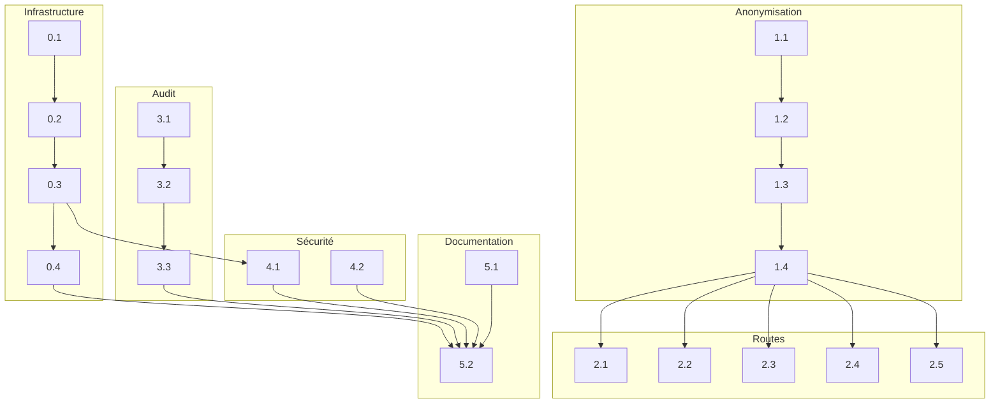

# 📋 Plan d'Exécution — Conformité HDS Super Assistant Médical

## Vue d'ensemble

| Métrique | Valeur |
|----------|--------|
| **Nombre de blocs** | 20 |
| **Estimation totale** | ~10 heures |
| **Stack** | Next.js 15, Scalingo HDS, GCP Healthcare FHIR, ioredis |

---

## Checklist Pré-démarrage

- [ ] Repository `smart-assistant-fb` accessible
- [ ] Compte Scalingo créé (accès HDS requis)
- [ ] Projet GCP avec Healthcare API activée
- [ ] Claude Code installé et configuré
- [ ] Docker installé (pour tests locaux)

---

## Séquence d'Exécution

### 🟡 Bloc 0 : Infrastructure Scalingo (~2h)

| Fichier | Titre | Status |
|---------|-------|--------|
| `bloc-0.1-nextjs-standalone-dockerfile.md` | Next.js standalone + Dockerfile | ⬜ À faire |
| `bloc-0.2-config-scalingo.md` | Configuration Scalingo | ⬜ À faire |
| `bloc-0.3-migration-redis-ioredis.md` | Migration Redis Upstash → ioredis | ⬜ À faire |
| `bloc-0.4-env-variables-scripts.md` | Variables d'environnement et scripts | ⬜ À faire |

### 🟡 Bloc 1 : Module Anonymisation (~2.5h)

| Fichier | Titre | Status |
|---------|-------|--------|
| `bloc-1.1-types-anonymisation.md` | Types et interfaces | ⬜ À faire |
| `bloc-1.2-patterns-detection.md` | Patterns de détection (regex) | ⬜ À faire |
| `bloc-1.3-service-anonymizer.md` | Service Anonymizer | ⬜ À faire |
| `bloc-1.4-deanonymizer-export.md` | Service Deanonymizer + Export | ⬜ À faire |

### 🟡 Bloc 2 : Intégration Routes API (~2h)

| Fichier | Titre | Status |
|---------|-------|--------|
| `bloc-2.1-route-ordonnances.md` | Route /api/ordonnances | ⬜ À faire |
| `bloc-2.2-route-bilans.md` | Route /api/bilans | ⬜ À faire |
| `bloc-2.3-route-generation-crc.md` | Route /api/generation/crc + claude-client | ⬜ À faire |
| `bloc-2.4-route-codage-suggest.md` | Route /api/codage/suggest | ⬜ À faire |
| `bloc-2.5-route-transcription.md` | Route /api/transcription | ⬜ À faire |

### 🟡 Bloc 3 : Audit FHIR Nominatif (~1.5h)

| Fichier | Titre | Status |
|---------|-------|--------|
| `bloc-3.1-types-audit.md` | Types et service d'audit | ⬜ À faire |
| `bloc-3.2-fhir-client-audit.md` | Wrapper FHIRClient audité | ⬜ À faire |
| `bloc-3.3-auth-helpers-enrichi.md` | Enrichissement auth-helpers | ⬜ À faire |

### 🟡 Bloc 4 : Sécurité (~1h)

| Fichier | Titre | Status |
|---------|-------|--------|
| `bloc-4.1-rate-limit-fail-secure.md` | Rate-limit fail-secure | ⬜ À faire |
| `bloc-4.2-documentation-csp.md` | Documentation CSP | ⬜ À faire |

### 🟡 Bloc 5 : Documentation & Finalisation (~1h)

| Fichier | Titre | Status |
|---------|-------|--------|
| `bloc-5.1-documentation-pra-pca.md` | Documentation PRA/PCA | ⬜ À faire |
| `bloc-5.2-readme-checklist-deploiement.md` | README + Checklist déploiement | ⬜ À faire |

---

## Ordre d'Exécution Recommandé

### Option A : Exécution séquentielle (solo)

```
1.1 → 1.2 → 1.3 → 1.4 (Anonymisation d'abord)
  ↓
2.1 → 2.2 → 2.3 → 2.4 → 2.5 (Routes API)
  ↓
0.1 → 0.2 → 0.3 → 0.4 (Infrastructure)
  ↓
4.1 (Rate-limit - dépend de 0.3)
  ↓
3.1 → 3.2 → 3.3 (Audit FHIR)
  ↓
4.2 → 5.1 → 5.2 (Documentation)
```

### Option B : Exécution parallèle (équipe)

```
Développeur 1           Développeur 2
─────────────           ─────────────
Bloc 0.x (Infra)        Bloc 1.x (Anonymisation)
    ↓                       ↓
Bloc 4.1 (Rate-limit)   Bloc 2.x (Routes API)
    ↓                       ↓
Bloc 3.x (Audit)        Bloc 4.2 + 5.x (Docs)
```

---

## Instructions d'utilisation

### Pour chaque bloc :

1. **Ouvrir** le fichier `.md` correspondant
2. **Copier** le contenu complet dans Claude Code
3. **Exécuter** et valider les critères de validation
4. **Cocher** ✅ dans ce fichier INDEX une fois terminé
5. **Passer** au bloc suivant

### Commande pour ouvrir un bloc :

```bash
cat /home/claude/prompts-hds-conformite/bloc-X.Y-nom.md
```

---

## Dépendances entre blocs



---

## Validation finale

Une fois tous les blocs terminés :

- [ ] `pnpm build` réussit sans erreur
- [ ] `pnpm tsc --noEmit` sans erreur TypeScript
- [ ] Tests manuels des fonctionnalités critiques
- [ ] Docker build et run fonctionnels
- [ ] Déploiement Scalingo réussi
- [ ] Checklist `docs/deployment-checklist.md` complétée

---

## Support

En cas de problème avec un bloc :

1. Vérifier les pré-requis du bloc
2. Relire les notes importantes en bas du bloc
3. Vérifier que les blocs dépendants sont terminés
4. Consulter la documentation des technologies utilisées

---

*Généré le 2 janvier 2025 — Plan de conformité HDS v1.0*
